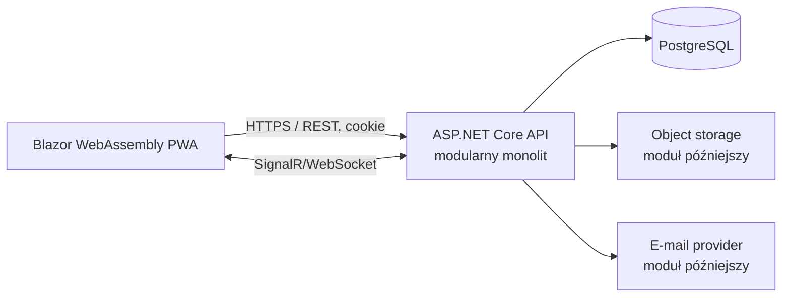
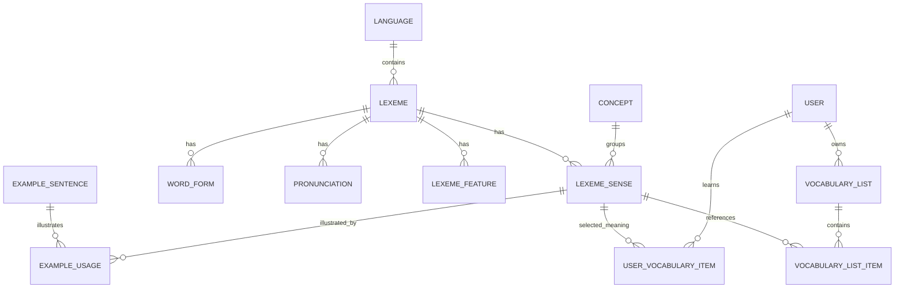
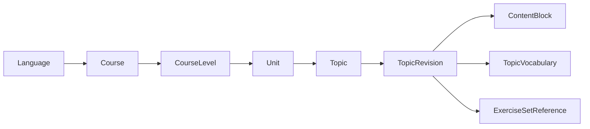

# Spracher — architektura systemu

Status dokumentu: **architektura bazowa przyjęta; Vocabulary i Exercise Engine 3A–3C ukończone**
Zakres: pierwsza wersja webowa/PWA oraz kierunek dalszego rozwoju SaaS  
Docelowy stos: .NET 10, ASP.NET Core, Blazor WebAssembly PWA, EF Core, PostgreSQL, SignalR

## 1. Cele i zasady

Spracher będzie rozwijany jako **modularny monolit**. Na początku oznacza to jeden wdrażalny backend, jedną bazę danych i jasno oddzielone moduły biznesowe. Granice modułów mają umożliwiać niezależne testowanie i rozwijanie funkcji, ale nie będziemy płacić kosztu operacyjnego mikroserwisów, rozproszonej spójności i wielu wdrożeń.

Najważniejsze zasady:

- jedna aplikacja backendowa ASP.NET Core udostępniająca REST API i huby SignalR;
- osobna aplikacja kliencka Blazor WebAssembly działająca jako PWA;
- PostgreSQL jako jedno źródło prawdy;
- moduły biznesowe z własnymi modelami, konfiguracjami EF Core i schematami PostgreSQL;
- zależności kierowane do wnętrza modułu: `Endpoints -> Application -> Domain`;
- infrastruktura implementuje porty zdefiniowane przez warstwę aplikacyjną/domenową;
- komunikacja między modułami przez jawne kontrakty aplikacyjne i zdarzenia wewnętrzne, a nie bezpośrednie używanie cudzych repozytoriów;
- REST i DTO na granicy systemu; encje EF Core nigdy nie są kontraktami API;
- projektowanie pod aktualne potrzeby z kontrolowanymi punktami rozszerzeń, bez budowania platformy pluginowej przed jej użyciem;
- wszystkie operacje I/O są asynchroniczne i przyjmują `CancellationToken`;
- logika biznesowa jest testowana bez uruchamiania bazy, a krytyczne przepływy przez testy integracyjne z prawdziwym PostgreSQL.

## 2. Kontekst i topologia



W środowisku produkcyjnym frontend i API powinny być dostępne pod tym samym originem, np. `https://app.example.com` i `https://app.example.com/api`. Upraszcza to uwierzytelnianie cookie, CORS, ochronę CSRF i instalację PWA. Statyczne pliki klienta może serwować reverse proxy albo host ASP.NET Core; jest to szczegół wdrożeniowy, a nie zależność domeny.

Docker Compose w środowisku lokalnym będzie uruchamiać co najmniej kontenery `api`, `web` i `postgres`. Produkcja nie musi używać Compose. Konfiguracja aplikacji pochodzi z `appsettings*.json` dla bezpiecznych wartości domyślnych oraz ze zmiennych środowiskowych/sekretów dla danych środowiskowych. Sekrety nie trafiają do repozytorium.

## 3. Styl modularnego monolitu

Każdy moduł jest pojedynczym assembly, wewnątrz którego znajdują się katalogi:

```text
Module/
├── Domain/          # encje, value objects, reguły, zdarzenia domenowe
├── Application/     # przypadki użycia, porty, walidacja, DTO wewnętrzne
├── Infrastructure/  # EF Core, integracje, implementacje portów
├── Endpoints/       # mapowanie REST i autoryzacja na granicy HTTP
└── Module.cs        # rejestracja DI, endpointów i konfiguracji modułu
```

To daje realne granice assembly bez tworzenia po cztery projekty dla każdego modułu. Jeśli konkretny moduł stanie się wystarczająco duży, można go później rozdzielić na osobne projekty bez zmiany publicznych kontraktów.

### Reguły zależności

- Moduł udostępnia na zewnątrz wyłącznie mały kontrakt/fasadę i zdarzenia integracyjne.
- Typy modułu są domyślnie `internal`.
- Moduł nie pobiera `DbSet` ani encji innego modułu.
- Identyfikatory obcych agregatów są przechowywane jako wartości skalarne. Stabilne powiązania mogą mieć klucze obce w tej samej bazie, ale nie wymagają nawigacji EF między modułami.
- Operacja obejmująca kilka modułów jest koordynowana przez przypadek użycia w warstwie aplikacyjnej. Początkowo może korzystać z jednej transakcji bazy.
- Zdarzenia domenowe są obsługiwane w procesie. Dla efektów wymagających niezawodności po zatwierdzeniu transakcji użyjemy tabeli outbox, kiedy pojawi się pierwszy taki przypadek (np. e-mail lub webhook).
- Nie wprowadzamy na starcie MediatR, magistrali zdarzeń, Event Sourcing ani osobnych read modeli tylko po to, by nazwać architekturę CQRS.

### EF Core i transakcje

Na początku używamy jednego technicznego `SpracherDbContext`, ponieważ upraszcza on migracje, transakcje obejmujące moduły i testy integracyjne. Encje i konfiguracje pozostają własnością modułów, a tabele są rozdzielone na schematy PostgreSQL. Dostęp do kontekstu nie może omijać fasad modułów.

Migracje mają jeden, liniowy strumień w projekcie Persistence. Rozdzielenie na wiele `DbContext` ma sens dopiero, gdy korzyść z silniejszej izolacji przewyższy koszt transakcji wielokontekstowych i koordynacji migracji.

`Spracher.Persistence` nie powinien mieć zależności kompilacyjnej do wszystkich modułów. Udostępnia techniczny kontekst i kontrakt konfiguratora modelu, a każdy moduł rejestruje własne konfiguracje encji w composition root. Moduł może używać kontekstu wyłącznie we własnej części Infrastructure. Dzięki temu unikamy cyklu zależności `Persistence <-> Modules`, zachowując jeden model i jeden strumień migracji.

## 4. Struktura solution

Docelowa struktura repozytorium:

```text
spracher/
├── Spracher.slnx
├── ARCHITECTURE.md
├── ROADMAP.md
├── Directory.Build.props
├── Directory.Packages.props
├── .editorconfig
├── .env.example
├── docker-compose.yml
├── src/
│   ├── Spracher.Api/                       # host, composition root, middleware
│   ├── Spracher.Web/                       # Blazor WebAssembly PWA
│   ├── Spracher.Contracts/                 # wersjonowane request/response API
│   ├── Spracher.BuildingBlocks/             # małe, stabilne prymitywy techniczne
│   ├── Spracher.IdentityModel/              # minimalne typy storage Identity współdzielone z Persistence
│   ├── Spracher.Persistence/                # DbContext, migracje, transakcje
│   └── Modules/
│       ├── Spracher.Modules.IdentityAccess/
│       ├── Spracher.Modules.Languages/
│       ├── Spracher.Modules.Vocabulary/
│       ├── Spracher.Modules.Content/
│       ├── Spracher.Modules.Exercises/
│       ├── Spracher.Modules.Learning/
│       ├── Spracher.Modules.Assessments/    # późniejszy etap MVP
│       ├── Spracher.Modules.Classrooms/     # późniejszy etap MVP
│       ├── Spracher.Modules.Gamification/   # późniejszy etap MVP
│       └── Spracher.Modules.Saas/           # po MVP
├── tests/
│   ├── Spracher.ArchitectureTests/
│   ├── Spracher.Api.IntegrationTests/
│   ├── Spracher.IdentityModel.UnitTests/
│   ├── Spracher.Web.Tests/
│   └── Modules/
│       ├── Spracher.Modules.Vocabulary.UnitTests/
│       ├── Spracher.Modules.Exercises.UnitTests/
│       └── Spracher.Modules.Learning.UnitTests/
├── deploy/
│   └── docker/
└── docs/
    └── adr/                                 # krótkie Architecture Decision Records
```

Nie wszystkie wymienione projekty należy utworzyć od razu. Pierwszy scaffold powinien zawierać tylko host, klienta, kontrakty, building blocks, persistence, IdentityAccess, Languages oraz pierwszy wdrażany moduł. Pozostałe pozycje opisują docelowe miejsce, a nie zadanie na pierwszy commit.

`Spracher.BuildingBlocks` nie może stać się katalogiem przypadkowych helperów. Dopuszczalne elementy to np. `EntityId`, `IClock`, wynik operacji, abstrakcja transakcji, audyt i obsługa zdarzeń domenowych. Reguły językowe oraz biznesowe pozostają w swoich modułach.

Współdzielony `CefrLevel` oraz wąski read contract `ILanguageCatalogReader` są świadomymi wyjątkami używanymi przez Languages i Vocabulary. Kontrakt zwraca wyłącznie stabilny opis aktywnego języka; nie udostępnia encji, `DbSet` ani możliwości mutacji katalogu.

## 5. Moduły domenowe

| Moduł | Odpowiedzialność | Nie należy do modułu |
|---|---|---|
| IdentityAccess | konto, logowanie, role, polityki dostępu, profil | postęp językowy, subskrypcja |
| Languages | katalog języków i profil językowy użytkownika | słownictwo i treści kursu |
| Vocabulary | koncepty, znaczenia, leksemy, formy, przykłady, prywatne słowa, listy i kategorie | harmonogram lekcji |
| Content | kursy, poziomy, jednostki, tematy, wersjonowane bloki teorii, publikacja | ocenianie odpowiedzi |
| Exercises | definicje ćwiczeń, wersje, walidatory, ocenianie, próby | układ kursu i plan dnia |
| Learning | zapis do kursu, sesje nauki, Daily Lesson, postęp, powtórki | definicje słów i ćwiczeń |
| Assessments | testy, pytania, podejścia, odpowiedzi, wyniki | członkostwo klasy |
| Classrooms | klasy, członkowie, zaproszenia, przydziały, prace domowe | silnik testów i treść ćwiczeń |
| Gamification | ledger XP, account level, streak, osiągnięcia, questy, rankingi | poziom CEFR użytkownika |
| LiveClassroom | sesja realtime, uczestnicy, komendy lekcji, quiz live | trwałe definicje ćwiczeń |
| Whiteboard | zdarzenia strokes, snapshoty, uprawnienia tablicy | przesyłanie bitmapy po każdym ruchu |
| SaaS | organizacje, plany, uprawnienia produktu, subskrypcje, billing | role pedagogiczne i postęp |

`LiveClassroom` i `Whiteboard` pozostają na razie granicami koncepcyjnymi. Nie tworzymy ich projektów ani tabel w MVP.

## 6. Model tożsamości, autoryzacji i SaaS

### Uwierzytelnianie

ASP.NET Core Identity przechowuje użytkowników, role i tokeny bezpieczeństwa w schemacie `iam`. Dla własnego klienta przeglądarkowego preferowane jest uwierzytelnianie bezpiecznym cookie (`HttpOnly`, `Secure`, odpowiednie `SameSite`) zamiast przechowywania tokenu dostępowego w `localStorage`. Mutujące endpointy muszą mieć ochronę antiforgery/CSRF.

Techniczne typy storage `ApplicationUser`, `ApplicationRole` i stałe ról znajdują się w małym projekcie `Spracher.IdentityModel`. Pozwala to klasie `SpracherDbContext` dziedziczyć z właściwego `IdentityDbContext<ApplicationUser, ApplicationRole, Guid>` bez zależności Persistence od modułu IdentityAccess i bez cyklu referencji. Projekt ten nie zawiera endpointów ani use cases; lifecycle konta pozostaje w IdentityAccess.

Role `SelfLearner`, `Student`, `Teacher`, `Admin`, a w przyszłości `SchoolAdmin`, są rolami wielowartościowymi Identity. Sama rola nie wystarcza do autoryzacji zasobu: nauczyciel może modyfikować tylko klasę, której jest właścicielem/członkiem z właściwym uprawnieniem. Stosujemy policies i resource-based authorization.

### Rozdzielenie poziomów

- `AccountLevel` 0–99 jest wyliczany przez Gamification na podstawie XP.
- `UserLanguageProfile.CurrentCefrLevel` jest osobny dla każdej pary użytkownik–język.
- Poziom kursu opisuje trudność materiału, a nie automatycznie kompetencję użytkownika.

### Przygotowanie do SaaS

Tożsamość użytkownika jest globalna. Dane osobiste należą do użytkownika, a przyszłe dane szkoły będą należeć do `Organization`. Nie dodajemy teraz `TenantId` do każdej tabeli ani generycznego `OwnerType/OwnerId` bez kluczy obcych. Przed School Plans powstanie moduł SaaS z `Organization`, `OrganizationMember`, `Plan`, `Subscription` i `Entitlement`, a agregaty współdzielone (np. klasa, test lub biblioteka materiałów) otrzymają jawne `OrganizationId`.

## 7. Początkowy model danych

### Konwencje

- klucze główne: UUID generowany w aplikacji jako UUIDv7;
- czas: `timestamptz`, zapisywany w UTC przez abstrakcję `IClock`;
- wymagane pola audytowe na korzeniach agregatów: `CreatedAt`, `UpdatedAt` oraz, gdy potrzebne, autor;
- kontrola współbieżności dla edytowanej treści i agregatów nauczyciela: jawny token `Version`;
- soft delete wyłącznie tam, gdzie biznes wymaga odtworzenia lub audytu; nie jako uniwersalna cecha encji;
- unikalność tekstu zależnego od wielkości liter realizowana świadomie przez znormalizowane kolumny lub indeksy PostgreSQL, nie przez przypadkowe porównanie CLR;
- pola JSONB tylko dla danych naprawdę zależnych od typu, zawsze z `SchemaVersion` i walidacją po stronie aplikacji.

Mapowanie schematów: `iam`, `languages`, `vocabulary`, `content`, `exercises` i `learning`; w kolejnych etapach `assessments`, `classrooms`, `gamification` oraz `saas`. Wspólna baza i cross-schema foreign keys dają integralność referencyjną. Granice modułu egzekwuje kod i testy architektury — rezygnacja z kluczy obcych tylko ze względu na hipotetyczne przyszłe mikroserwisy byłaby przedwczesna.

### Schemat `iam`

| Encja | Najważniejsze pola i relacje |
|---|---|
| `ApplicationUser` | rozszerzenie Identity; `Id`, status konta, nazwa wyświetlana, strefa czasu i daty audytowe |
| `ApplicationRole` | role systemowe, relacja M:N z użytkownikiem przez Identity |

W pierwszym przyroście niewielkie pola profilu są częścią `ApplicationUser`; nie tworzymy pustej abstrakcji ani tabeli 1:1. Rozbudowane preferencje prywatności można później wydzielić, gdy pojawią się konkretne wymagania. Profil nie duplikuje danych bezpieczeństwa Identity. Przyszły avatar będzie referencją do zasobu, a nie bajtami w bazie.

### Schemat `languages`

| Encja | Najważniejsze pola i relacje |
|---|---|
| `Language` | `Id`, unikalny `Code` (BCP 47/ISO), `Name`, `NativeName`, kierunek pisma, `IsActive` |
| `UserLanguageProfile` | unikalne `UserId + LanguageId`, flagi native/learning, `CurrentCefrLevel`, cel, data rozpoczęcia |

Języki są danymi, nie enumem i nie kolumnami. Dodanie języka nie zmienia schematu. Kontrolowanym value objectem/enumem może być CEFR: `A0`, `A1`, `A2`, `B1`, `B2`, `C1`, `C2`, ponieważ opisuje standard aplikacji, nie listę języków.

### Schemat `vocabulary`



| Encja | Odpowiedzialność |
|---|---|
| `Concept` | niezależny od języka węzeł znaczenia, np. „instytucja finansowa”; może mieć relacje broader/narrower/related |
| `Lexeme` | jednostka językowa: `LanguageId`, lemma, znormalizowana lemma, część mowy, domyślny CEFR, frequency rank, notatki, źródło i widoczność |
| `LexemeSense` | konkretne znaczenie leksemu połączone z `Concept`; definicja, rejestr, opcjonalny CEFR override |
| `WordForm` | odmieniona forma, tagi gramatyczne, forma znormalizowana |
| `Pronunciation` | zapis IPA/tekstowy, wariant regionalny, opcjonalna referencja do audio |
| `LexemeFeature` | rozszerzalne cechy `Key/Value`, np. gender lub article; pozwala dodać język bez migracji |
| `ExampleSentence` | zdanie w jednym języku, źródło i status publikacji |
| `ExampleUsage` | M:N pomiędzy zdaniem a `LexemeSense`, opcjonalnie zakres tekstu wyróżnianego w zdaniu |
| `ExampleSentenceRelation` | opcjonalne połączenie zdań, np. tłumaczenie/parafraza; nie zakłada relacji 1:1 słów |
| `UserVocabularyItem` | `UserId + LexemeSenseId`, status New/Learning/Learned/Suspended, daty i statystyki |
| `VocabularyList` | lista użytkownika lub później organizacji/klasy, nazwa i widoczność |
| `VocabularyListItem` | pozycja listy wskazująca `LexemeSense`, kolejność i notatka autora |
| `VocabularyCategory` | prywatna kategoria użytkownika |
| `UserVocabularyItemCategory` | M:N pomiędzy pozycją użytkownika a kategorią |
| `VocabularyReviewState` | bieżący stan harmonogramu powtórek; model oddzielony od samego słowa |
| `VocabularyReviewLog` | niezmienny zapis odpowiedzi i jakości powtórki |

Kandydaci na tłumaczenie są wyznaczani przez wspólny `Concept` i relacje semantyczne, a nie przez kolumnę ani obowiązkową parę `Lexeme -> Lexeme`. Leksem może mieć wiele znaczeń, jedno znaczenie wiele leksemów w tym samym języku, a odpowiedniki w innych językach mogą mieć inny zakres semantyczny. System nie obiecuje, że samo współdzielenie konceptu oznacza pełne tłumaczenie 1:1 w każdym kontekście.

Własne słowo użytkownika jest prywatnym `Lexeme` ze wskazanym `OwnerUserId` i źródłem `UserCreated`. Jeśli wymaga nowego znaczenia, może używać prywatnego `Concept`. Publikacja takiej pozycji do katalogu globalnego będzie osobnym, późniejszym procesem moderacji; nie zmieniamy właściciela danych „w miejscu”.

Kluczowe ograniczenia i indeksy:

- unikalny aktywny `Language.Code`;
- indeks na `(LanguageId, NormalizedLemma)` oraz `(LanguageId, PartOfSpeech, NormalizedLemma)`;
- indeks na `(LexemeId, ConceptId)`; `LexemeSense` zachowuje własną tożsamość, ponieważ rejestr lub zakres użycia może uzasadniać więcej niż jedno sense w obrębie konceptu;
- unikalny `(UserId, LexemeSenseId)` w `UserVocabularyItem`;
- unikalny `(VocabularyListId, LexemeSenseId)` w liście, jeśli produkt nie zezwoli na duplikaty;
- indeksy na CEFR, frequency rank, status publikacji oraz termin kolejnej powtórki.

#### Stan implementacji po slice 2B

Zaimplementowany schemat `vocabulary` obejmuje `Concepts`, `Lexemes`, `LexemeSenses`, `WordForms`, `Pronunciations`, `LexemeFeatures`, `ExampleSentences`, `ExampleUsages`, `UserVocabularyItems`, `VocabularyLists`, `VocabularyListItems`, `VocabularyCategories` i `UserVocabularyItemCategories`. Relacje semantyczne pomiędzy zdaniami oraz stan i historia powtórek pozostają projektami docelowymi i nie mają jeszcze tabel.

Lista należy do jednego użytkownika, a jej pozycja wskazuje `LexemeSense`; ten sam sens nie może wystąpić na tej samej liście dwa razy. Kategoria również należy do jednego użytkownika, ale przypisanie M:N jest wiązane z jego `UserVocabularyItem`, dzięki czemu kategoryzacja dotyczy osobistego postępu, a nie globalnego katalogu. Odczyt i każda mutacja sprawdzają właściciela zasobu po stronie serwera.

Widoczność katalogowa i prywatna jest jawna. Prywatny `Concept`, `Lexeme` i `LexemeSense` mają `OwnerUserId`; zapytania publiczne dopuszczają wyłącznie opublikowany katalog, a zapytania uwierzytelnione dodatkowo dane właściciela. Uczoną jednostką jest `LexemeSense`, nie cały leksem, dzięki czemu użytkownik może znać jedno znaczenie wieloznacznego słowa i nadal uczyć się drugiego.

Moduł Vocabulary nie ma referencji do modułu Languages. Aktywność języków odczytuje przez `ILanguageCatalogReader`. Fizyczne cross-schema foreign keys `Lexeme.LanguageId`, `LexemeSense.DefinitionLanguageId` i `ExampleSentence.LanguageId` są składane przez host API, który jako composition root zna oba moduły. Test architektury nadal zabrania referencji pomiędzy assembly modułów.

Dane katalogowe przechowują `SourceType` i `SourceReference`. Prywatne duplikaty chroni częściowy indeks unikalny `(OwnerUserId, LanguageId, PartOfSpeech, NormalizedLemma)`, a dodanie znaczenia do słownika — `(UserId, LexemeSenseId)`. Konflikty współbieżnych zapisów są mapowane na wynik idempotentny albo HTTP 409 zamiast niekontrolowanego błędu serwera.

### Schemat `content`



| Encja | Odpowiedzialność |
|---|---|
| `Course` | język docelowy, tytuł, slug, opis, status i autor/właściciel |
| `CourseLevel` | część kursu przypisana do CEFR, kolejność |
| `Unit` | logiczna sekcja poziomu, kolejność |
| `Topic` | stabilna tożsamość tematu i wskaźnik opublikowanej rewizji |
| `TopicRevision` | wersja robocza/opublikowana, numer, autor, daty publikacji |
| `ContentBlock` | typ renderera, kolejność, `SchemaVersion`, dane typu w JSONB |
| `TopicVocabulary` | słownictwo tematu wskazujące `LexemeSense` |
| `ExerciseSetReference` | przypięta, wersjonowana referencja do zestawu ćwiczeń |

Typy bloków startowych mogą obejmować `RichText`, `Callout`, `Example`, `Table` i `Media`. Wspólne metadane są relacyjne, a payload zależny od typu jest JSONB. Każdy typ ma walidator po backendzie i renderer po frontendzie. Nie przechowujemy wykonywalnego kodu ani dowolnego HTML od administratora.

Opublikowana rewizja jest niemutowalna. Zmiana tworzy kolejną wersję roboczą. Dzięki temu zapis postępu i wynik ćwiczenia zawsze można odtworzyć względem wersji, którą widział użytkownik.

### Schemat `exercises`

| Encja | Odpowiedzialność |
|---|---|
| `ExerciseDefinition` | stabilna tożsamość ćwiczenia, `TypeKey`, metadane i archiwizacja |
| `ExerciseVersion` | numer wersji, `SchemaVersion`, polecenie, typowany payload JSONB, status i data publikacji |
| `ExerciseSet` | uporządkowana grupa przypiętych wersji ćwiczeń |
| `ExerciseSetItem` | przypięta wersja ćwiczenia i jednoznaczna pozycja w zestawie |
| `ExerciseAttempt` | użytkownik, przypięta wersja, opcjonalna pozycja źródłowego zestawu, rozpoczęcie/zakończenie, wynik i status |
| `ExerciseSubmission` | odpowiedź użytkownika w wersjonowanym payloadzie, wynik oceny i bezpieczny feedback |

Silnik używa rejestru handlerów, np. `IExerciseTypeHandler`, rozdzielonego na:

- walidację definicji treści;
- przygotowanie bezpiecznego DTO dla klienta bez klucza odpowiedzi;
- walidację odpowiedzi użytkownika;
- deterministyczne ocenianie, jeśli typ na to pozwala;
- budowę feedbacku;
- odpowiadający renderer/edytor w Blazorze rejestrowany przez `TypeKey`.

Dodanie nowego rodzaju zwykle wymaga nowego handlera i komponentu UI, ale nie nowego systemu prób, postępu ani testów. Nie próbujemy sprowadzić wszystkich odpowiedzi do stringa. `MultipleChoice`, `FillInBlank`, `Translation`, `SentenceOrdering` itd. mają własne wersjonowane schematy payloadu. `Writing` i `Speaking` mogą zwracać stan `PendingReview`, ponieważ nie zawsze da się je uczciwie ocenić automatycznie.

Klucze odpowiedzi nigdy nie trafiają do publicznego DTO. Próba wiąże się z dokładną `ExerciseVersion`, nie z „najnowszą wersją”.

Slice 3A–3C implementuje tabele definicji, wersji, zestawów, pozycji zestawu, prób i odpowiedzi, handlery `MultipleChoice`, `FillInBlank` i `Translation` oraz rejestrowane renderery Blazor pod `/practice`. Nowa definicja zaczyna jako draft, przechodzi walidację handlerem i dopiero jawna publikacja udostępnia ją w katalogu. `ExerciseSet` również ma workflow draft → publikacja, a każda pozycja przypina konkretną opublikowaną wersję. Próba rozpoczęta z zestawu zapisuje `ExerciseSetItemId`, dlatego źródło i kolejność są audytowalne. Klucz odpowiedzi pozostaje wyłącznie w serwerowym JSONB; publiczny payload zawiera tylko dane potrzebne rendererowi.

Docelowy katalog typów i jego etapowanie:

| Typ | Sposób obsługi | Plan |
|---|---|---|
| `MultipleChoice` | jedna/wiele odpowiedzi, losowanie kontrolowane seedem | slice 3A — działa |
| `FillInBlank` | jedna lub kilka luk, akceptowane warianty odpowiedzi | slice 3B — działa |
| `Translation` | krótkie odpowiedzi z wieloma akceptowanymi wariantami | slice 3C — działa |
| `WriteWord` | zapis formy/leksemu na podstawie wskazówki | następny przyrost |
| `MatchPairs` | dwie kolekcje i mapa par | następny przyrost |
| `SentenceOrdering` | tokeny i poprawne sekwencje | następny przyrost |
| `TrueFalse` | stwierdzenie, wartość i wyjaśnienie | następny przyrost |
| `Listening` | wersjonowany asset audio oraz odpowiedź właściwego podtypu | po wdrożeniu media storage |
| `Speaking` | nagranie/rozpoznanie i ocena manualna lub zewnętrzna | po MVP i analizie prywatności |

Dłuższe `Writing` korzysta z tego samego lifecycle prób, lecz powinno być osobnym typem z rubryką i oceną `PendingReview`, a nie rozszerzeniem `WriteWord`.

### Schemat `learning`

| Encja | Odpowiedzialność |
|---|---|
| `CourseEnrollment` | użytkownik, kurs, stan i wybrany poziom/start |
| `TopicProgress` | użytkownik, temat/rewizja, status, mastery i daty |
| `LearningSession` | sesja Daily Lesson, review lub treningu, kontekst języka |
| `LearningSessionItem` | źródło aktywności, kolejność, status i wynik |
| `DailyLessonPlan` | plan użytkownika na konkretny dzień i język |
| `DailyLessonItem` | przypięty materiał/ćwiczenie/powtórka z przyczyną doboru |

Daily Lesson jest orkiestratorem korzystającym z Content, Exercises i Vocabulary. Nie jest osobnym formatem treści. Początkowo plan może być budowany prostymi, deterministycznymi regułami, a dopiero później algorytmem adaptacyjnym.

Flashcards, vocabulary training, translation, sentence building i reviews są różnymi trybami budowania `LearningSession` z tych samych wersjonowanych ćwiczeń i pozycji słownictwa. Grammar jest treścią kursu dostarczaną przez Content Engine, a nie osobnym rodzajem strony lub kopią Exercise Engine.

### Schematy późniejszych modułów

Assessments:

- `Test` — stabilna tożsamość, autor, klasa/właściciel, ustawienia;
- `TestVersion` — niemutowalna opublikowana konfiguracja;
- `TestQuestion` — przypięta `ExerciseVersion`, punkty, kolejność;
- `TestAttempt` — uczeń, wersja testu, czas, status i suma punktów;
- `StudentAnswer` — pytanie, odpowiedź, ocena automatyczna/ręczna i feedback.

Classrooms:

- `Classroom`, `ClassroomMember`, `ClassroomInvitation`;
- `Assignment`, `AssignmentItem`, `AssignmentRecipient`, `Submission`, `Grade`;
- materiały, lista słownictwa i test są wskazywane przez typowane kontrakty modułów, a nie kopiowane do klasy.

Ten model obsłuży tworzenie klas, dodawanie/zapraszanie uczniów, przydzielanie materiału i słownictwa, pracę domową, kartkówki oraz sprawdziany. Odczyt wyników i postępu jest widokiem składającym dane z Classrooms, Assessments i Learning; Classroom nie przejmuje własności tych modeli.

Gamification:

- `XpLedgerEntry` jako niezmienny i idempotentny zapis źródła XP;
- `UserGamificationProfile` jako szybka projekcja sumy XP i Account Level 0–99;
- `UserStreak`, `AchievementDefinition`, `UserAchievement`;
- później `QuestDefinition`, `UserQuestProgress` i okresowe projekcje leaderboardów.

Poziom konta jest wyliczany z progów wersjonowanych przez produkt. Nigdy nie zapisujemy go w `UserLanguageProfile`.

## 8. API i warstwa aplikacyjna

- publiczne endpointy są wersjonowane pod `/api/v1`;
- endpoint jest cienki: mapuje kontrakt, uruchamia przypadek użycia, mapuje wynik;
- request/response zewnętrzne znajdują się w `Spracher.Contracts`; kontrakty modułów wewnętrznych pozostają w modułach;
- walidacja syntaktyczna jest wykonywana na granicy, a inwarianty biznesowe w domenie;
- błędy są zwracane jako spójne `ProblemDetails` z kodem błędu i correlation/trace id;
- paginacja jest obowiązkowa dla kolekcji; dla katalogu słów preferowana będzie paginacja kursorowa;
- filtrowanie i sortowanie mają jawne, dozwolone pola;
- idempotency key zostanie zastosowany do operacji podatnych na retry, szczególnie XP, submit testu i przyszły billing;
- pliki audio/obrazy nie przechodzą przez encje ani payload JSONB — API przechowuje metadane i referencję do object storage.

## 9. PWA i frontend

Blazor WebAssembly jest klientem API, nie miejscem reguł autoryzacji ani zaufanego oceniania. Frontend może wykonywać walidację dla UX, lecz serwer powtarza wszystkie kontrole.

Architektura UI powinna rozdzielać:

- `Features/<Feature>` — strony, komponenty i stan konkretnego przypadku użycia;
- `Shared` — design system, layout i elementy dostępności;
- `ApiClient` — typowane klienty REST oraz obsługa błędów;
- `Authentication` — stan sesji, bez przechowywania sekretów w local storage;
- `Pwa` — manifest, service worker, kontrolowana strategia cache.

Pierwsze PWA daje instalowalną powłokę i cache statycznych assetów. Pełny tryb offline oraz synchronizacja edycji nie są częścią MVP. Mutacje wymagają połączenia, a klient jednoznacznie pokazuje stan offline. Nie należy cache'ować odpowiedzi zawierających dane prywatne lub klucze ćwiczeń w publicznym cache service workera.

Mobile-first oznacza projekt od małych viewportów, obsługę dotyku, focus/klawiatury, dostępność WCAG, niewielkie payloady i testy na realnych szerokościach. Nie oznacza osobnego backendu dla mobile.

## 10. Realtime, Live Classroom i Whiteboard

SignalR zostanie dodany dopiero z pierwszym przypadkiem realtime. Trwały stan lekcji nadal należy do bazy; hub nie jest repozytorium ani źródłem prawdy.

Planowana tablica przesyła zdarzenia:

- `StrokeStarted`, `StrokePointsAppended`, `StrokeEnded`;
- `ElementAdded`, `ElementMoved`, `ElementRemoved`;
- `BoardCleared` i okresowy `BoardSnapshotCreated`.

Zdarzenia zawierają `SessionId`, `BoardId`, `ActorId`, monotoniczny numer sekwencji, identyfikator operacji i wersję protokołu. Klient pobiera ostatni snapshot, a potem brakujące zdarzenia. Należy przewidzieć autoryzację grup SignalR, rate limiting, ograniczenie rozmiaru komunikatu, reconnect i deduplikację. Skalowanie na kilka instancji API może później wymagać backplane, ale nie instalujemy go przed potrzebą.

## 11. Bezpieczeństwo, prywatność i niezawodność

- wymuszane HTTPS, bezpieczne nagłówki, CSP dopasowane do Blazor WASM;
- rate limiting dla logowania, rejestracji, wyszukiwania i odpowiedzi;
- policy/resource authorization po stronie serwera dla każdego zasobu nauczyciela i administratora;
- brak sekretów i kluczy odpowiedzi w logach oraz DTO;
- walidacja przesyłanych plików i przechowywanie poza procesem aplikacji;
- audyt operacji administratora, publikacji treści, zmiany ocen i członkostwa klasy;
- przygotowanie polityk retencji/usunięcia danych i eksportu danych użytkownika;
- szczególna analiza prawna i privacy-by-design przed obsługą niepełnoletnich uczniów;
- backup PostgreSQL oraz okresowo testowane odtwarzanie, nie tylko samo wykonywanie kopii;
- health checks oddzielające liveness i readiness.

## 12. Obserwowalność i jakość

- strukturalne logowanie z `TraceId`, `UserId` po bezpiecznej pseudonimizacji, `Module` i kodem przypadku użycia;
- OpenTelemetry dla trace'ów, metryk i zależności, gdy powstanie środowisko wdrożeniowe;
- metryki produktowe odseparowane od logów technicznych;
- globalny middleware wyjątków mapujący znane błędy na `ProblemDetails`;
- unit testy inwariantów domenowych, oceniania i planowania powtórek;
- integration testy endpointów z PostgreSQL uruchamianym w kontenerze, prawdziwym pipeline autoryzacji i migracjami;
- architecture tests sprawdzające zakazane zależności między modułami;
- testy kontraktów serializacji wersjonowanych payloadów JSONB;
- e2e tylko dla kilku najważniejszych ścieżek, aby nie budować kruchej piramidy testów.

## 13. Największe ryzyka architektoniczne

| Ryzyko | Skutek | Ograniczenie ryzyka |
|---|---|---|
| Nadmiernie generyczny Exercise Engine | trudny edytor, wyjątkowe typy i słaba walidacja | wspólny lifecycle + osobne wersjonowane schematy i handlery typów |
| Mutowanie opublikowanej treści | niewytłumaczalne wyniki i utrata historii | niemutowalne wersje tematów, ćwiczeń i testów |
| Niska jakość danych słownikowych | błędna nauka i duplikaty znaczeń | provenance, moderacja, normalizacja i import etapami |
| Uproszczenie tłumaczeń do par słów | model nie obsłuży wieloznaczności | `Concept` + `LexemeSense` + `Lexeme`, brak kolumn per język |
| JSONB bez kontraktu | dane, których nie da się wyrenderować | `TypeKey`, `SchemaVersion`, walidatory i testy migracji treści |
| Scope creep | brak działającej wersji mimo wielu tabel | pionowe etapy z kryteriami ukończenia opisane w ROADMAP |
| Pełny offline za wcześnie | konflikty, wycieki cache, duży koszt synchronizacji | MVP online-first, offline tylko dla bezpiecznej powłoki |
| Role użyte zamiast uprawnień zasobu | nauczyciel uzyskuje dostęp do cudzej klasy | policies + resource authorization + testy negatywne |
| XP i streak aktualizowane wielokrotnie po retry | błędny poziom i rankingi | idempotentny ledger i jednoznaczne źródło zdarzenia |
| Zbyt późne ownership organizacyjne | trudna migracja School Plans | jawne ownership agregatów i moduł Organization przed szkołami |
| Rosnący katalog 10 000+ słów/język | wolne wyszukiwanie i importy | indeksy, normalizacja, batch import i provenance |
| Realtime traktowany jako stan trwały | utrata lekcji po restarcie | baza jako źródło prawdy, snapshoty i sekwencje zdarzeń |
| Dane niepełnoletnich | ryzyko prawne i reputacyjne | privacy review przed Teacher/School rollout, minimalizacja danych |

## 14. Świadomie odłożone elementy

Na obecnym etapie nie implementujemy:

- mikroserwisów, Kubernetesa, service mesh i zewnętrznej magistrali zdarzeń;
- organizacji, subskrypcji, płatności, faktur i entitlementów;
- Live Classroom, 2D świata, SignalR hubów i Whiteboard;
- pełnego offline, synchronizacji konfliktów i natywnych aplikacji mobilnych;
- zaawansowanego spaced repetition/adaptive learning — najpierw zbieramy poprawne dane prób;
- wszystkich typów ćwiczeń; pierwszy pionowy slice powinien obsłużyć najwyżej 2–3 typy;
- Speaking, rozpoznawania mowy, automatycznego oceniania długiego Writing i funkcji AI;
- pełnego CMS/WYSIWYG; początkowo wystarczy kontrolowane authoring API lub narzędzie administracyjne dla wybranych bloków;
- wszystkich gamification mechanics, rankingów i questów;
- automatycznego importu 10 000 słów dla pięciu języków w jednym kroku;
- zaawansowanej wyszukiwarki z osobnym silnikiem, dopóki PostgreSQL wystarcza;
- generycznego repozytorium nad EF Core, Event Sourcing i frameworkowego CQRS;
- abstrakcji pod hipotetyczną zmianę PostgreSQL lub Blazor.

## 15. Decyzje wymagające ADR przy implementacji

Przed odpowiednim etapem warto zapisać krótkie ADR dla:

1. modelu hostowania Blazor PWA i API pod jednym originem;
2. strategii cookie/antiforgery dla klienta WASM;
3. granic modułów i użycia jednego `DbContext`;
4. kontraktu oraz wersjonowania payloadów Content/Exercise;
5. własności i procesu moderacji słownictwa użytkowników;
6. algorytmu powtórek po zebraniu wymagań;
7. modelu organizacji i izolacji tenantów przed School Plans;
8. trwałości zdarzeń Whiteboard przed pracami realtime.

Roadmapa realizacji i kryteria kolejnych etapów znajdują się w [ROADMAP.md](./ROADMAP.md).
